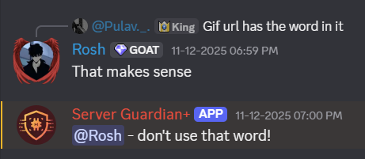

# 🛡️ Server Guardian+

An AI-powered Discord moderation bot that leverages Google's Gemini API to automatically detect and handle toxicity, spam, and hate speech in real-time. Keep your Discord community safe and organized with intelligent, context-aware moderation.


## ✨ Features

- 🤖 **AI-Powered Detection** - Uses Google's Gemini API for contextual understanding of toxicity, hate speech, and spam
- ⚡ **Real-Time Moderation** - Automatically detects and deletes inappropriate messages
- ⚙️ **Configurable Thresholds** - Customize warning and mute thresholds based on your community needs
- 📊 **Detailed Logging** - Maintains comprehensive moderation logs in dedicated mod-only channels
- 🔔 **Warning System** - Progressive warning system before taking stricter actions
- 🔇 **Auto-Mute** - Automatically mutes repeat offenders based on warning count
- 📋 **Moderation Dashboard** - Easy-to-read logs for moderators to track incidents

## 🎯 How It Works

1. **Message Monitoring** - The bot monitors all messages in configured channels
2. **AI Analysis** - Each message is analyzed by Google's Gemini API for toxic content
3. **Instant Action** - Detected violations trigger immediate deletion and user warnings
4. **Progressive Enforcement** - Multiple warnings lead to automatic muting
5. **Audit Trail** - All actions are logged for moderator review


*Example: Bot detecting and removing vulgar language while warning the user*

## 🚀 Getting Started

### Prerequisites

- Python 3.8 or higher
- Discord Bot Token
- Google Gemini API Key

### Installation

1. **Clone the repository**
```bash
   git clone https://github.com/yourusername/server-guardian-plus.git
   cd server-guardian-plus
```

2. **Install dependencies**
```bash
   pip install -r requirements.txt
```

3. **Set up environment variables**
   
   Create a `.env` file in the root directory:
```env
   DISCORD_TOKEN=your_discord_bot_token
   GEMINI_API_KEY=your_gemini_api_key
```

4. **Configure the bot**
   
   Edit `config.json` to customize settings:
```json
   {
     "warning_threshold": 3,
     "mute_duration": 600,
     "log_channel_id": "your_log_channel_id",
     "moderation_enabled": true
   }
```

5. **Run the bot**
```bash
   python bot.py
```

## 📝 Configuration

### config.json Parameters

| Parameter | Description | Default |
|-----------|-------------|---------|
| `warning_threshold` | Number of warnings before auto-mute | 3 |
| `mute_duration` | Mute duration in seconds | 600 (10 min) |
| `log_channel_id` | Channel ID for moderation logs | - |
| `moderation_enabled` | Enable/disable auto-moderation | true |
| `toxicity_threshold` | AI confidence threshold (0-1) | 0.7 |

## 🎮 Commands

| Command | Description | Permission |
|---------|-------------|------------|
| `!warnings @user` | Check warning count for a user | Moderator |
| `!clearwarnings @user` | Clear warnings for a user | Admin |
| `!config` | View current bot configuration | Admin |
| `!toggle` | Enable/disable moderation | Admin |

## 🔧 Tech Stack

- **Language**: Python 3.8+
- **Discord Library**: discord.py 2.0+
- **AI/ML**: Google Gemini API
- **Environment Management**: python-dotenv
- **Data Storage**: JSON (expandable to database)

## 📂 Project Structure
```
server-guardian-plus/
│
├── bot.py                 # Main bot file
├── cogs/
│   ├── moderation.py      # Moderation commands and logic
│   └── logging.py         # Logging functionality
├── utils/
│   ├── ai_moderator.py    # Gemini API integration
│   └── database.py        # Warning/user data management
├── config.json            # Configuration file
├── requirements.txt       # Python dependencies
├── .env.example          # Environment variables template
└── README.md             # Documentation
```

## 🤝 Contributing

Contributions are welcome! Please follow these steps:

1. Fork the repository
2. Create a feature branch (`git checkout -b feature/AmazingFeature`)
3. Commit your changes (`git commit -m 'Add some AmazingFeature'`)
4. Push to the branch (`git push origin feature/AmazingFeature`)
5. Open a Pull Request

## 📋 Roadmap

- [ ] Add multi-language support
- [ ] Implement database storage (PostgreSQL/MongoDB)
- [ ] Create web dashboard for analytics
- [ ] Add custom word filters
- [ ] Implement appeal system
- [ ] Support for image/media moderation

## ⚠️ Disclaimer

This bot uses AI for content moderation, which may not be 100% accurate. Always have human moderators review flagged content. The bot is designed to assist, not replace, human moderation.

## 📄 License

This project is licensed under the MIT License - see the [LICENSE](LICENSE) file for details.

## 🙏 Acknowledgments

- [Discord.py](https://github.com/Rapptz/discord.py) - Discord API wrapper
- [Google Gemini](https://ai.google.dev/) - AI moderation capabilities
- Discord community for testing and feedback

## 📧 Contact

LinkedIn Profile: www.linkedin.com/in/roshan-kamath-9806b337b 

---

⭐ If you found this project helpful, please consider giving it a star!
